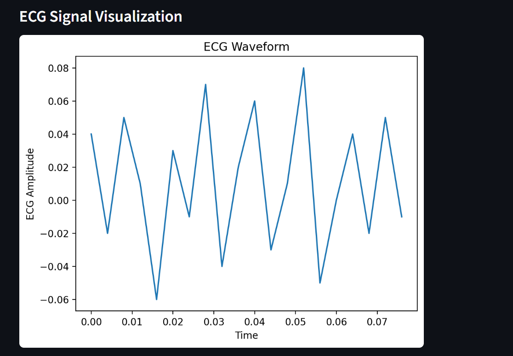
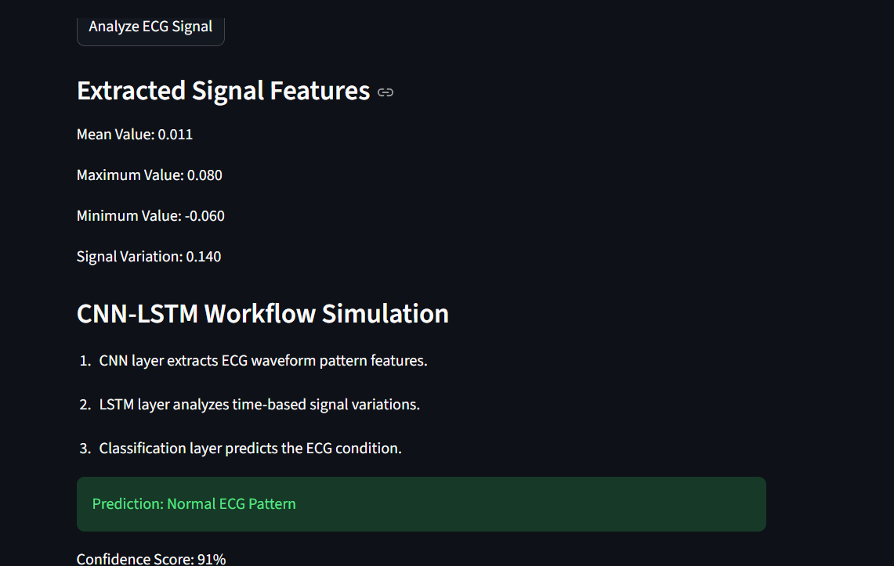
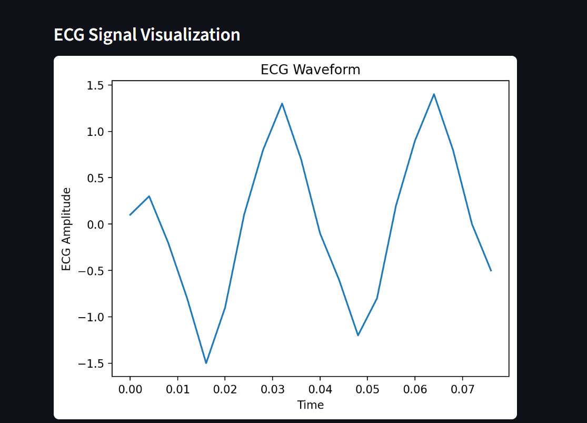
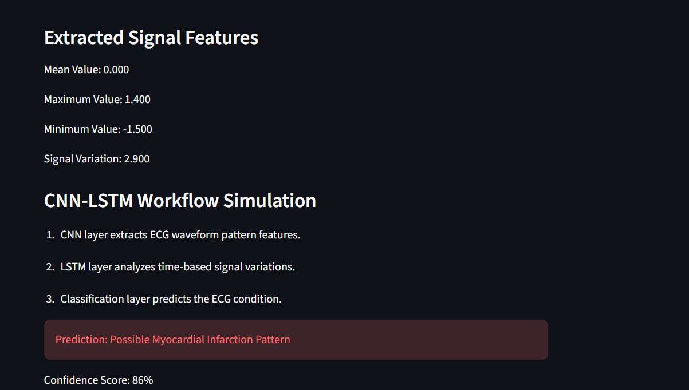

***# IoT-Enabled Real-Time Myocardial Infarction Tracker***


***A seminar-level prototype demo for ECG signal visualization and myocardial infarction detection workflow.***


***## Features***


***- ECG CSV upload option***

***- Simulated ECG sample data***

***- ECG waveform visualization***

***- CNN-LSTM workflow explanation***

***- Basic signal-based prediction demo***


***## Proposed System Flow***


***AD8232 ECG Sensor → ESP32 → Cloud Server → CNN-LSTM Model → Alert System***


***## Technologies Used***


***- Python***

***- Streamlit***

***- NumPy***

***- Pandas***

***- Matplotlib***


***## How to Run***


***```bash***

***pip install -r requirements.txt***

***python -m streamlit run app.py***
## 📷 Demo

### 🟢 Normal ECG

#### Graph


#### Result


---

### 🔴 Abnormal ECG (Possible MI)

#### Graph


#### Result


